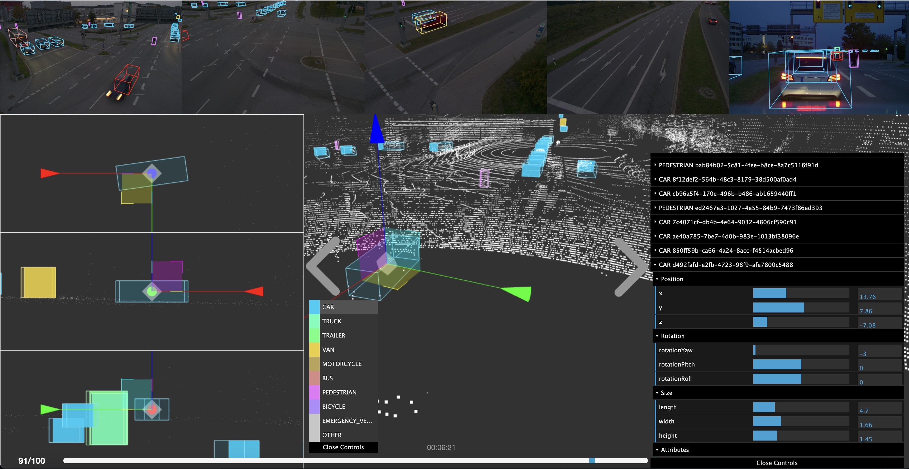
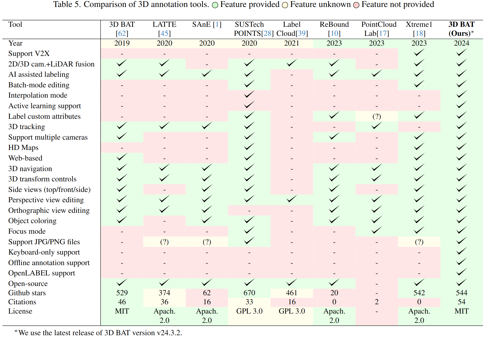

[](https://innovation-mobility.com/tumtraf-dataset)
[](https://tum-traffic-dataset.github.io/tumtraf-v2x/)
[](https://github.com/tum-traffic-dataset/tum-traffic-dataset-dev-kit)
[](https://ieeexplore.ieee.org/document/8814071)
[](https://arxiv.org/pdf/2403.01316.pdf)
<a href="https://github.com/walzimmer/3d-bat/stargazers"></a>
<a href="https://github.com/walzimmer/3d-bat/network/members"></a>
<a href="https://github.com/walzimmer/3d-bat/pulls"></a>
<a href="https://github.com/walzimmer/3d-bat/issues"></a>
[](https://ieeexplore.ieee.org/document/8814071)


<h1 align="center">3D Bounding Box Annotation Toolbox</h1>




# Overview ✨
- [News](#news)
- [Features](#features)
- [Release Notes](#release-notes)
- [Quick Start](#quick-start)
- [Custom Data Annotation](#custom-data-annotation)
- [Labeling Instructions](#labeling-instructions)
- [Commands and Shortcuts](#commands-and-shortcuts)
- [Tutorial Videos](#tutorial-videos)
- [Documentation](#documentation)
- [Citation](#citation)
- [License](#license)


# News 📢
- 2024/02: Accepted paper at [CVPR'24](https://cvpr.thecvf.com/) conference: [TUMTraf V2X Cooperative Perception Dataset](https://arxiv.org/pdf/2403.01316.pdf)
- 2024/01: Active learning support. Submitted paper at [IV'24](https://2023.ieee-itsc.org/) conference: [ActiveAnno3D - An Active Learning Framework for
  Multi-Modal 3D Object Detection](https://arxiv.org/pdf/2402.03235.pdf)
- 2023/09: 🏆 [IEEE Best Student Paper Award](https://2023.ieee-itsc.org/best-paper-awards/) at the [ITSC'23](https://2023.ieee-itsc.org/) conference: [TUMTraf Intersection Dataset: All You Need for Urban 3D Camera-LiDAR Roadside Perception](https://ieeexplore.ieee.org/document/10422289)
- 2022/08: AI-assisted labeling feature
- 2022/04: Accepted paper at [IV'22](https://2022.ieee-iv.org/) conference: [A9-Dataset: Multi-Sensor Infrastructure-Based Dataset for Mobility Research
  ](https://ieeexplore.ieee.org/document/9827401)
- 2021/02: Updated version of 3D Bounding Box Annotation Toolbox (3D BAT 2021)
- 2019/04: Accepted paper at [IV'19](https://2019.ieee-iv.org/) conference: [3D BAT: A Semi-Automatic, Web-based 3D Annotation Toolbox for Full-Surround, Multi-Modal Data Streams](https://ieeexplore.ieee.org/document/8814071)
- 2019/03: First release of the 3D Bounding Box Annotation Toolbox

[](https://www.youtube.com/watch?v=gSGG4Lw8BSU "Video")    

# Features 🔥
- [x] Full-surround annotations
- [x] AI assisted labeling
- [x] Batch-mode editing
- [x] Interpolation mode
- [x] 3D to 2D label transfer (projections)
- [x] Automatic tracking 
- [x] Side views (top, front, side)
- [x] Navigation in 3D
- [x] Auto ground detection
- [x] 3D transform controls
- [x] Perspective view editing
- [x] Orthographic view editing
- [x] 2D and 3D annotations
- [x] Web-based (online accessible & platform ind.)
- [x] Redo/undo functionality
- [x] Keyboard-only annotation mode
- [x] Auto save function
- [x] Review annotations
- [x] Sequence mode
- [x] Active learning support
- [x] HD map support
- [x] Copy labels to next frame
- [x] Switching between datasets and sequences
- [x] Custom dataset support
- [x] Custom classes support
- [x] Custom attributes support
- [x] V2X support
- [x] OpenLABEL support
- [x] Support multiple sensors
- [x] Object coloring
- [x] Focus mode
- [x] Support JPG/PNG files
- [x] Offline annotation support
- [x] Open source
- [x] Customizable and extendable
- [x] Zooming into images




# Release Notes 📝
- 2024/03: **3D BAT v24.3.2**
  - Added support to label V2X data
  - Load and display HD maps
  - Added support for custom object classes
  - Added support for custom attributes
  - Added support for custom datasets
  - Added support for OpenLABEL
  - Added support for active learning
  - Added support for AI-assisted labeling
- 2019/02: **3D BAT v19.2.1** 
  - First release to label full-surround vehicle data (3D to 2D label transfer, side views, automatic tracking, interpolation mode, batch-mode editing)


# Quick Start 🚀

#### 1. Install npm
+ Linux: `sudo apt-get install npm`
+ Windows: https://nodejs.org/dist/v10.15.0/node-v10.15.0-x86.msi
+ Mac: https://blog.teamtreehouse.com/install-node-js-npm-mac

#### 2. Clone repository:
```shell
git clone https://github.com/walzimmer/3d-bat.git & cd 3d-bat
```
#### 3. Install required python packages:
```shell
conda create -n 3d-bat python==3.11.3
conda activate 3d-bat
pip install -r requirements.txt
conda install -c conda-forge nodejs==10.13.0
```
#### 4. Install required node packages:
```shell
npm install
```


#### 5.  Start the backend-server
```shell
npm run start-server
```
#### 6. Start the labeling tool application
```shell
npm run start
```
The `index.html` file should open now in the specified browser (chromium-browser by default).
The default browser can be changed in the `package.json` file, line 32:
```json
"start": "webpack serve --inline --open chromium-browser",
```


# Custom Data Annotation 🌟
See [Custom Data Annotation](./docs/custom_data_tutorial.md) for more details.


# Labeling Instructions 🗒

Instructions for data annotation can be found [here](./instructions.md).


# Commands and Shortcuts 👨🏽‍💻

See [Commands and Shortcuts](./docs/commands.md) for more details.

<!-- TODO : Insert video -->

# Tutorial Videos 📹
- [3D Bounding Box Annotation Toolbox - Tutorial](https://www.youtube.com/watch?v=gSGG4Lw8BSU)
- Further tutorial videos are available under the `./tutorial_videos` folder.
  - 3D Box Transformation (position, rotation, scale)
  - Image and Point Cloud Annotation
  - Interpolation mode
  - Using the side views (top, front, side)
  - Reset and undo/redo functionality


## 📚 Documentation
A [readthedocs](https://3d-bat-docs.readthedocs.io/en/latest/) documentation will be available soon.

## 📝 Citation
If you use 3D Bounding Box Annotation Toolbox in your research, please cite the following papers:
```
@inproceedings{zimmermann20193d,
  title={3D BAT: A Semi-Automatic, Web-based 3D Annotation Toolbox for Full-Surround, Multi-Modal Data Streams},
  author={Zimmer, Walter and Rangesh, Akshay and Trivedi, Mohan M.},
  booktitle={2019 IEEE Intelligent Vehicles Symposium (IV)},
  pages={1--8},
  year={2019},
  organization={IEEE}
}
@inproceedings{cress2022a9,
  author={Creß, Christian and Zimmer, Walter and Strand, Leah and Fortkord, Maximilian and Dai, Siyi and Lakshminarasimhan, Venkatnarayanan and Knoll, Alois},
  booktitle={2022 IEEE Intelligent Vehicles Symposium (IV)}, 
  title={A9-Dataset: Multi-Sensor Infrastructure-Based Dataset for Mobility Research}, 
  year={2022},
  volume={},
  number={},
  pages={965-970},
  doi={10.1109/IV51971.2022.9827401}
}
@inproceedings{zimmer2023tumtraf,
  title={TUMTraf Intersection Dataset: All You Need for Urban 3D Camera-LiDAR Roadside Perception [Best Student Paper Award]},
  author={Zimmer, Walter and Cre{\ss}, Christian and Nguyen, Huu Tung and Knoll, Alois C},
  publisher = {IEEE},
  booktitle={2023 IEEE Intelligent Transportation Systems ITSC},
  year={2023}
}
@inproceedings{zimmer2024tumtrafv2x,
  title={TUMTraf V2X Cooperative Perception Dataset},
  author={Zimmer, Walter and Wardana, Gerhard Arya and Sritharan, Suren and Zhou, Xingcheng and Song, Rui and Knoll, Alois C.},
  publisher={IEEE/CVF},
  booktitle={2024 IEEE/CVF International Conference on Computer Vision and Pattern Recognition (CVPR)},
  year={2024}
}
```


## 📜 License
```
Copyright © 2019 The Regents of the University of California

All Rights Reserved. Permission to copy, modify, and distribute this tool for educational, research and non-profit purposes, without fee, and without a written agreement is hereby granted, provided that the above copyright notice, this paragraph and the following three paragraphs appear in all copies. Permission to make commercial use of this software may be obtained by contacting:

Office of Innovation and Commercialization
9500 Gilman Drive, Mail Code 0910
University of California
La Jolla, CA 92093-0910
(858) 534-5815
innovation@ucsd.edu

This tool is copyrighted by The Regents of the University of California. The code is supplied “as is”, without any accompanying services from The Regents. The Regents does not warrant that the operation of the tool will be uninterrupted or error-free. The end-user understands that the tool was developed for research purposes and is advised not to rely exclusively on the tool for any reason.

IN NO EVENT SHALL THE UNIVERSITY OF CALIFORNIA BE LIABLE TO ANY PARTY FOR DIRECT, INDIRECT, SPECIAL, INCIDENTAL, OR CONSEQUENTIAL DAMAGES, INCLUDING LOST PROFITS, ARISING OUT OF THE USE OF THIS TOOL, EVEN IF THE UNIVERSITY OF CALIFORNIA HAS BEEN ADVISED OF THE POSSIBILITY OF SUCH DAMAGE. THE UNIVERSITY OF CALIFORNIA SPECIFICALLY DISCLAIMS ANY WARRANTIES, INCLUDING, BUT NOT LIMITED TO, THE IMPLIED WARRANTIES OF MERCHANTABILITY AND FITNESS FOR A PARTICULAR PURPOSE. THE TOOL PROVIDED HEREUNDER IS ON AN “AS IS” BASIS, AND THE UNIVERSITY OF CALIFORNIA HAS NO OBLIGATIONS TO PROVIDE MAINTENANCE, SUPPORT, UPDATES, ENHANCEMENTS, OR MODIFICATIONS.
```